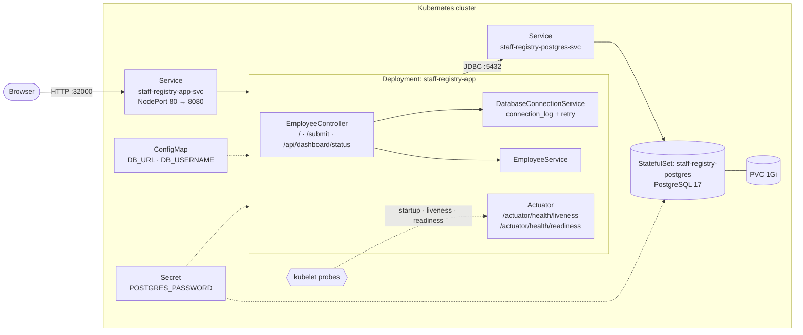

# Staff Registry

Employee directory built with Spring Boot 4 (Java 25) and PostgreSQL, deployed to Kubernetes with Helm.
Add employees, browse the directory, and see Kubernetes startup, liveness and readiness probes in action.

## Architecture



| Component | Kind | Purpose |
|---|---|---|
| `staff-registry-app` | Deployment | Spring Boot web app (UI + API + health endpoints) |
| `staff-registry-app-svc` | Service (NodePort) | Exposes the app, port 80 → 8080, NodePort 32000 |
| `staff-registry-postgres` | StatefulSet | PostgreSQL 17 with a 1Gi persistent volume |
| `staff-registry-postgres-svc` | Service | Stable DNS name used by the app for the database |
| `staff-registry-app-config` | ConfigMap | `DB_URL`, `DB_USERNAME` |
| `staff-registry-postgres-secret` | Secret | Database user, password and name |

Tables `employees` and `connection_log` are created automatically by the app on first use.

### Health probes

| Probe | Endpoint | Checks | On failure |
|---|---|---|---|
| Startup | `/actuator/health/liveness` | App is responding | Keep waiting (up to 5 min) |
| Liveness | `/actuator/health/liveness` | App is alive (no DB check) | Restart the container |
| Readiness | `/actuator/health/readiness` | App **and** database are up | Remove pod from Service, no restart |

If the database goes down, the pod stays running but stops receiving traffic. It recovers on its own when the database returns.

## Prerequisites

- Kubernetes cluster (kind, minikube, or a real cluster) and `kubectl`
- [Helm](https://helm.sh/docs/intro/install/) 3
- Docker (only needed if you build the image yourself)
- JDK 25 and Maven (only needed for local development)

## Deploy with Helm

The chart is in [`helm/staff-registry`](helm/staff-registry). Default image: `devopscube/staff-registry:1.0.0`.

### 1. Install

```bash
helm install staff-registry ./helm/staff-registry --wait --timeout 5m
```

`--wait` returns once PostgreSQL and the app are both ready.

### 2. Check the release

```bash
kubectl get pods
kubectl get svc
```

Expected: `staff-registry-app-...` and `staff-registry-postgres-0` both `1/1 Running`.

### 3. Open the app

```bash
kubectl port-forward svc/staff-registry-app-svc 8080:80
```

Open http://localhost:8080. (On a cluster with reachable nodes you can use `http://<node-ip>:32000` instead.)

### 4. Upgrade or change settings

```bash
# Example: run 2 replicas
helm upgrade staff-registry ./helm/staff-registry --set app.replicas=2

# Example: use another image tag
helm upgrade staff-registry ./helm/staff-registry --set app.image.tag=1.0.1
```

All options are in [`helm/staff-registry/values.yaml`](helm/staff-registry/values.yaml) (image, resources, probes, service, database).

### 5. Uninstall

```bash
helm uninstall staff-registry

# The database volume is kept by Kubernetes. Delete it for a clean start:
kubectl delete pvc postgres-storage-staff-registry-postgres-0
```

If the PVC is not removed, a later install reuses the old database data.

> Change `postgres.password` in `values.yaml` (or pass `--set postgres.password=...`) before using this outside a demo.

## Build and push your own image

```bash
docker buildx build --platform linux/amd64,linux/arm64 \
  -t <your-dockerhub-user>/staff-registry:1.0.0 --push .
```

Then install with your image:

```bash
helm install staff-registry ./helm/staff-registry \
  --set app.image.repository=<your-dockerhub-user>/staff-registry \
  --set app.image.tag=1.0.0
```

### Local image on kind or minikube (no push)

```bash
docker build -t staff-registry:local .
kind load docker-image staff-registry:local        # or: minikube image load staff-registry:local

helm install staff-registry ./helm/staff-registry \
  --set app.image.repository=staff-registry \
  --set app.image.tag=local \
  --set app.image.pullPolicy=IfNotPresent
```

## Try the probes

```bash
# 1. Stop the database
kubectl scale statefulset staff-registry-postgres --replicas=0

# 2. Readiness fails: pod shows 0/1 and leaves the Service. Liveness still passes, no restart.
kubectl get pods -w
kubectl get endpoints staff-registry-app-svc

# 3. Start the database again: pod becomes 1/1 on its own
kubectl scale statefulset staff-registry-postgres --replicas=1
```

Call the probe endpoints directly:

```bash
kubectl exec deploy/staff-registry-app -- wget -qO- localhost:8080/actuator/health/liveness
kubectl exec deploy/staff-registry-app -- wget -qO- localhost:8080/actuator/health/readiness
```

## Useful commands

```bash
kubectl logs -f deploy/staff-registry-app
kubectl exec -it staff-registry-postgres-0 -- psql -U postgres -d staffdb -c "SELECT * FROM connection_log;"
kubectl exec -it staff-registry-postgres-0 -- psql -U postgres -d staffdb -c "SELECT name, job_title FROM employees;"
helm status staff-registry
helm get values staff-registry
```

## Run locally (without Kubernetes)

```bash
# PostgreSQL
docker run -d --name staff-pg -p 5432:5432 \
  -e POSTGRES_PASSWORD=postgres123 -e POSTGRES_DB=staffdb postgres:17-alpine

# App
cd staff-registry-app
mvn spring-boot:run
```

Open http://localhost:8080. Defaults (`localhost:5432`, `staffdb`, `postgres` / `postgres123`) can be overridden with `DB_URL`, `DB_USERNAME` and `DB_PASSWORD`.

## API and endpoints

| Method | Path | Description |
|---|---|---|
| GET | `/` | Web UI: add employee form and directory |
| POST | `/submit` | Save an employee (form post) |
| GET | `/api/dashboard/status` | JSON: employee count, DB status, recent connection log |
| GET | `/actuator/health/liveness` | Liveness probe |
| GET | `/actuator/health/readiness` | Readiness probe (includes DB) |
| GET | `/actuator/prometheus` | Metrics |

## Project layout

```
.
├── Dockerfile
├── helm/staff-registry/        Helm chart (Chart.yaml, values.yaml, templates/)
├── k8s-manifest/               Plain manifests (app.yaml, postgres.yaml), alternative to Helm
└── staff-registry-app/
    ├── pom.xml
    └── src/main/
        ├── resources/application.yml
        └── java/com/example/staffregistry/
            ├── StaffRegistryApplication.java
            ├── controller/EmployeeController.java
            ├── model/ConnectionLog.java
            └── service/        EmployeeService, DatabaseConnectionService
```
