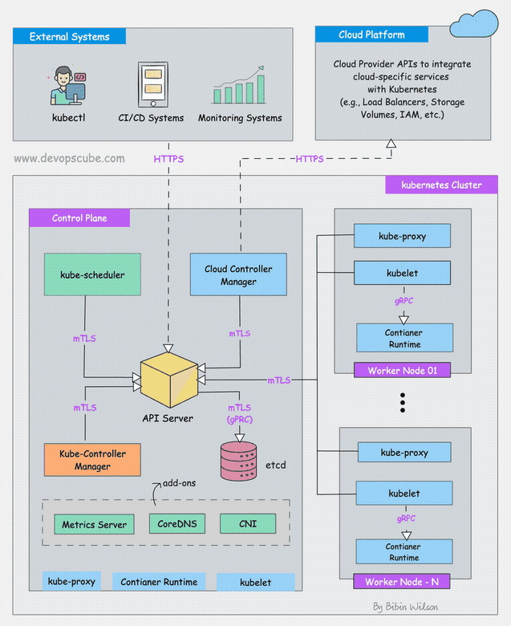
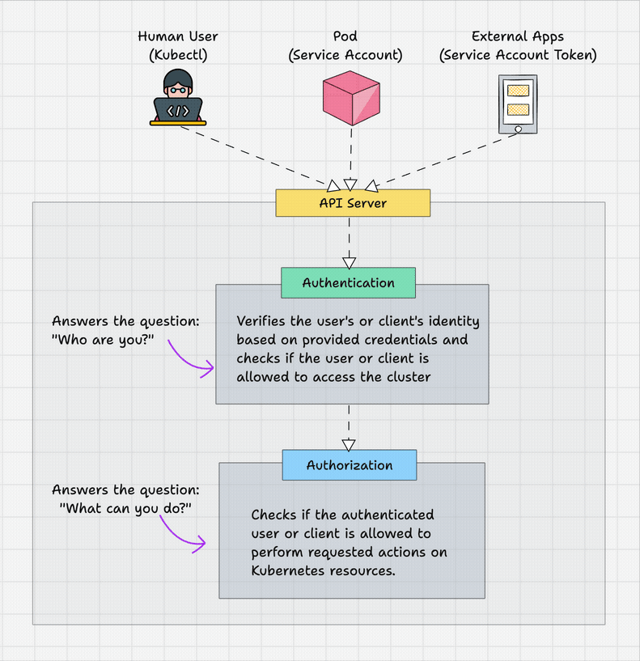
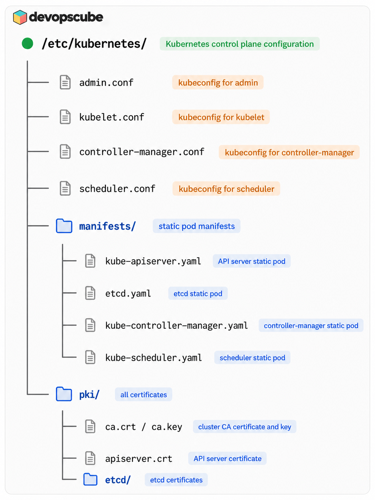
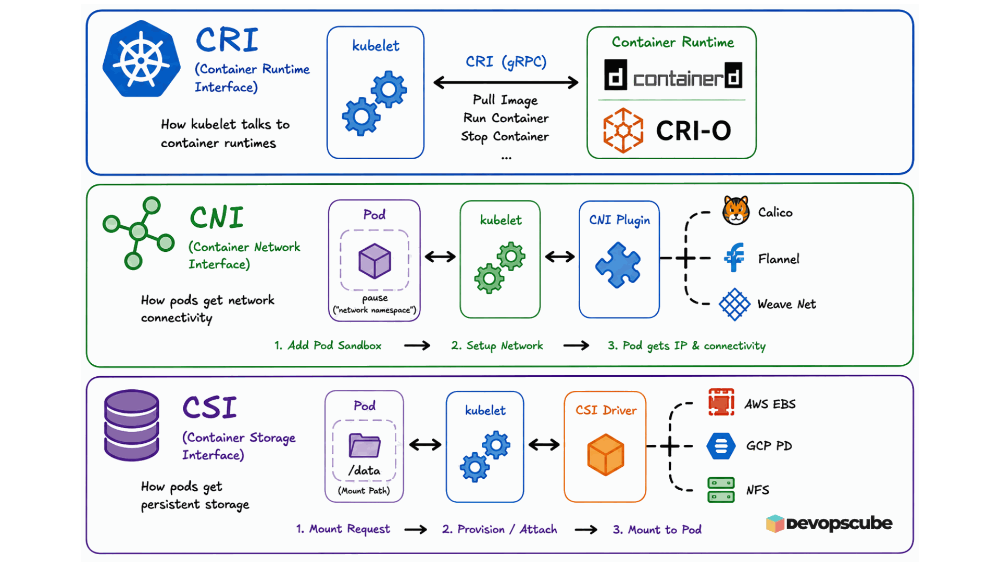
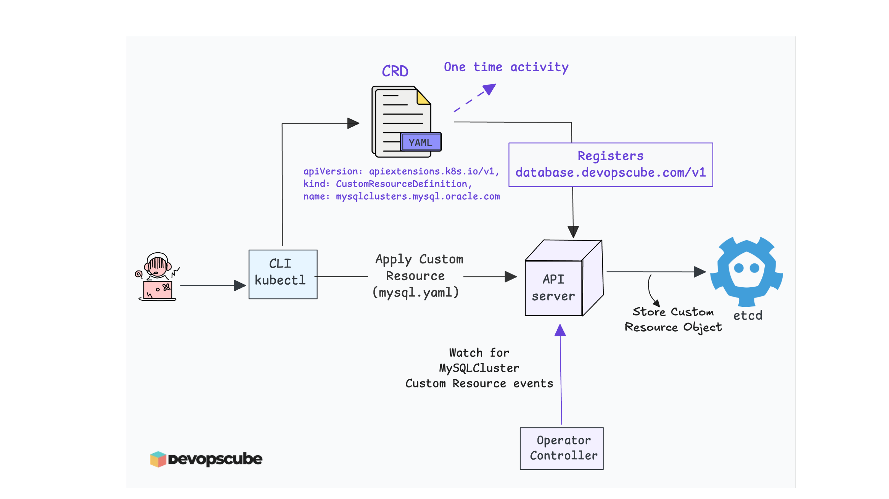
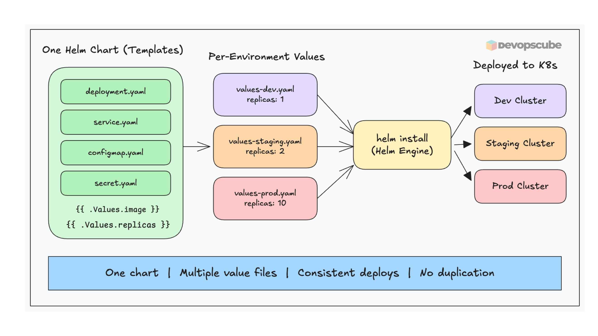
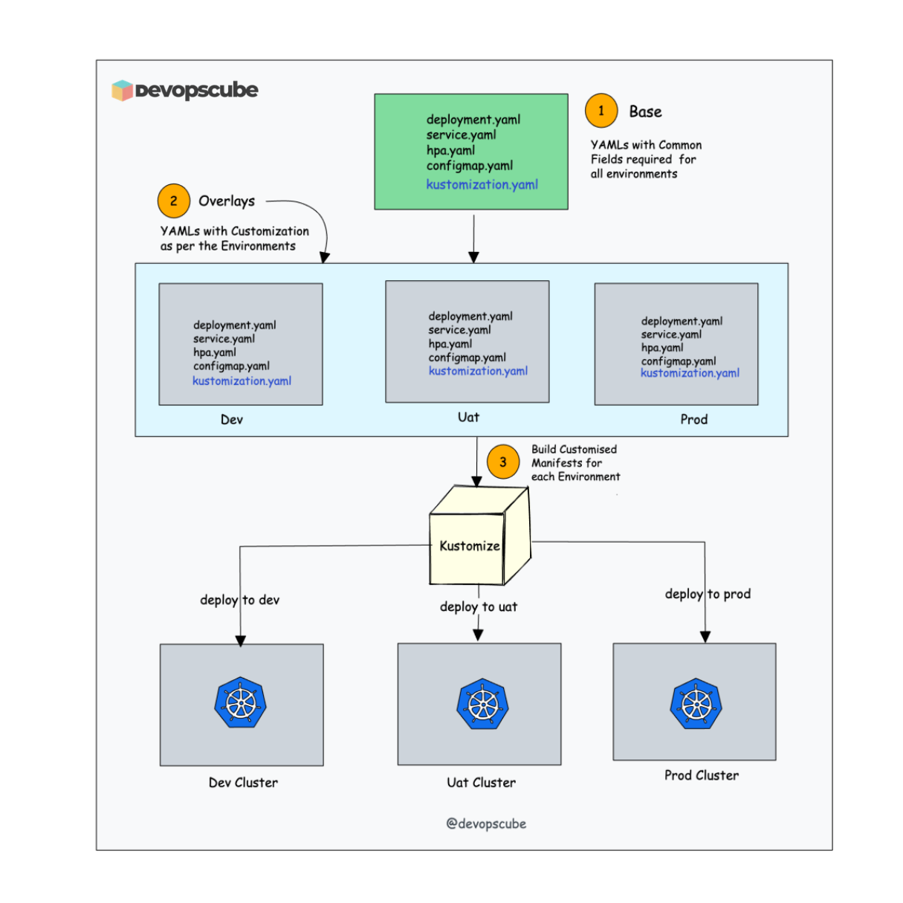

# Kubernetes Cluster Architecture for CKA — RBAC, kubeadm, CRDs & Extension Interfaces (25%)

> **Exam Weight: 25%** — Focus on RBAC, kubeadm cluster lifecycle, and extension interfaces.

**Q: What is the difference between Role and ClusterRole in Kubernetes?**

A: A `Role` grants permissions within a single namespace. A `ClusterRole` grants permissions across all namespaces (or for cluster-scoped resources like nodes). A `RoleBinding` can reference either — but a RoleBinding always limits scope to its own namespace. Use ClusterRole + ClusterRoleBinding for cluster-wide access.

---

## Index

1. [Kubernetes Architecture Overview](#kubernetes-architecture-overview)
2. [RBAC (Role-Based Access Control)](#rbac-role-based-access-control)
3. [ServiceAccounts](#serviceaccounts)
4. [kubeadm Cluster Lifecycle](#kubeadm-cluster-lifecycle)
5. [Extension Interfaces](#extension-interfaces)
6. [Custom Resource Definitions (CRDs)](#custom-resource-definitions-crds)
7. [Helm & Kustomize](#helm--kustomize)


---

## Kubernetes Architecture Overview

> 👉 **Deep Dive Lesson:** [Kubernetes Architecture ](https://courses.devopscube.com/courses/certified-kubernetes-administrator-course/lectures/60080221)


  


### Control Plane Components

| Component | Role |
|-----------|------|
| `kube-apiserver` | Central hub — all API requests go through here |
| `etcd` | Cluster state database — key/value store |
| `kube-scheduler` | Assigns pods to nodes based on resources/constraints |
| `kube-controller-manager` | Runs reconciliation loops (deployment, replicaset, etc.) |
| `cloud-controller-manager` | Integrates with cloud provider APIs |

### Node Components

| Component | Role |
|-----------|------|
| `kubelet` | Agent on each node — ensures containers run as specified |
| `kube-proxy` | Maintains network rules (iptables/ipvs) for services |
| Container Runtime | Runs containers (containerd, CRI-O) |


---

## RBAC (Role-Based Access Control)

> 👉 **Deep Dive Lesson:** [RBAC](https://courses.devopscube.com/courses/certified-kubernetes-administrator-course/lectures/55733267) | [ServiceAccounts](https://courses.devopscube.com/courses/certified-kubernetes-administrator-course/lectures/55724447) | [Roles & ClusterRoles](https://courses.devopscube.com/courses/certified-kubernetes-administrator-course/lectures/55724449) | [RoleBindings & ClusterRoleBindings](https://courses.devopscube.com/courses/certified-kubernetes-administrator-course/lectures/55997133)


  


### Core RBAC Objects

| Object | Scope | Purpose |
|--------|-------|---------|
| `Role` | Namespace | Defines permissions within a namespace |
| `ClusterRole` | Cluster-wide | Defines permissions across all namespaces |
| `RoleBinding` | Namespace | Binds Role or ClusterRole to a user/group/SA (namespace-scoped) |
| `ClusterRoleBinding` | Cluster-wide | Binds ClusterRole to a user/group/SA (cluster-wide) |

### RBAC Subjects

Subjects can be:
- **User**: `--user=alice`
- **Group**: `--group=dev-team`
- **ServiceAccount**: `--serviceaccount=namespace:sa-name`

### Key Points

- A `RoleBinding` can reference a `ClusterRole` — but the permissions are limited to the namespace of the binding
- `ClusterRoleBinding` + `ClusterRole` = cluster-wide permissions
- Always verify with `kubectl auth can-i`

---

## ServiceAccounts

- Every pod gets a ServiceAccount token automatically (default SA if not specified)
- Tokens are mounted at `/var/run/secrets/kubernetes.io/serviceaccount/`
- Use `automountServiceAccountToken: false` to opt out
- ServiceAccounts are namespace-scoped

```yaml
spec:
  serviceAccountName: my-sa
  automountServiceAccountToken: false  # disable auto-mount
```

---

## kubeadm Cluster Lifecycle

> 👉 **Deep Dive Lesson:** [Cluster Configurations](https://courses.devopscube.com/courses/certified-kubernetes-administrator-course/lectures/55120266) | [Cluster Upgrades](https://courses.devopscube.com/courses/certified-kubernetes-administrator-course/lectures/55120133)

### Init Phases (what kubeadm does)

1. Preflight checks
2. Generate certificates (in `/etc/kubernetes/pki/`)
3. Generate kubeconfig files
4. Generate static pod manifests
5. Wait for control plane
6. Upload config to ConfigMap
7. Mark control plane node with taint
8. Generate bootstrap tokens
9. Install addons (CoreDNS, kube-proxy)

### Key Files After Init


  

### Upgrade Path

**Control Plane (one minor version at a time):**
1. Upgrade `kubeadm`
2. `kubeadm upgrade plan` → `kubeadm upgrade apply vX.Y.Z`
3. Drain control plane: `kubectl drain <node> --ignore-daemonsets`
4. Upgrade `kubelet` and `kubectl`
5. `systemctl daemon-reload && systemctl restart kubelet`
6. `kubectl uncordon <node>`

**Worker Nodes (repeat per worker):**
1. Drain worker: `kubectl drain <worker> --ignore-daemonsets --delete-emptydir-data`
2. SSH to worker
3. Upgrade `kubeadm`, run `kubeadm upgrade node`
4. Upgrade `kubelet` and `kubectl`
5. Restart kubelet
6. `kubectl uncordon <worker>`


---

## Extension Interfaces


  


| Interface | Purpose |
|-----------|---------|
| **CRI** (Container Runtime Interface) | How kubelet talks to container runtimes (containerd, CRI-O) |
| **CNI** (Container Network Interface) | How pods get network connectivity (Calico, Flannel, Weave) |
| **CSI** (Container Storage Interface) | How pods get persistent storage (AWS EBS, GCP PD, NFS) |

---

## Custom Resource Definitions (CRDs)

 > 👉 **Deep Dive Lesson:** [Custom Resource Definitions (CRDs and Operators)](https://courses.devopscube.com/courses/certified-kubernetes-administrator-course/lectures/58698982)

 


CRDs extend the Kubernetes API with custom resource types:

```yaml
apiVersion: apiextensions.k8s.io/v1
kind: CustomResourceDefinition
metadata:
  name: foos.example.com
spec:
  group: example.com
  names:
    kind: Foo
    plural: foos
  scope: Namespaced
  versions:
  - name: v1
    served: true
    storage: true
    schema:
      openAPIV3Schema:
        type: object
```

**Operators** use CRDs to automate complex application management (install → configure → upgrade → backup).

---

## Helm & Kustomize

> 👉 **Deep Dive Lesson:** [Helm](https://courses.devopscube.com/courses/certified-kubernetes-administrator-course/lectures/62134793)


  


### Helm (Package Manager)

- **Chart** = package of K8s manifests
- **Release** = deployed instance of a chart
- **Repository** = collection of charts

```bash
helm repo add <name> <url>
helm install <release> <chart> --namespace <ns>
helm upgrade <release> <chart> --set key=value
helm rollback <release> <revision>
helm uninstall <release>
helm list -A
```


### Kustomize (Template-free customization)


  


- Base + Overlays pattern
- No templating — uses strategic merge patches
- Built into `kubectl apply -k`

```
base/
  kustomization.yaml
  deployment.yaml
overlays/
  production/
    kustomization.yaml   ← patches base
    patch.yaml
```

---

## Exam Focus Points

1. **RBAC** -> Most commonly tested. Know all 4 objects and `auth can-i`
2. **Cluster upgrade** -> Know the drain → upgrade → uncordon flow
3. **kubeadm join** -> Know how to get and use the join token
4. **ServiceAccounts** -> Know how to create and bind

---

*Next: [Workloads & Scheduling](./02-workloads-scheduling.md)*
