# Kubernetes Workloads & Scheduling for CKA → Deployments, HPA, Node Affinity & Probes (15%)

> **Exam Weight: 15%** -> Focus on Deployments, scheduling constraints, and resource management.

**Q: How does Kubernetes schedule a pod?**

A: The kube-scheduler selects a node in two phases: (1) **Filtering** -> eliminates nodes that don't meet the pod's requirements (resources, taints, affinity, node selectors); (2) **Scoring** -> ranks remaining nodes and picks the highest score. The kubelet on the winning node then pulls the image and starts the container.

**Q: What is the difference between liveness and readiness probes in Kubernetes?**

A: A **liveness probe** restarts the container if it fails (the process is alive but broken). A **readiness probe** removes the pod from service endpoints if it fails (the pod is up but not ready to handle traffic). A **startup probe** delays both until the app finishes initializing.

---

## Index

1. [Workload Types](#workload-types)
2. [Deployments](#deployments)
3. [Scheduling](#scheduling)
4. [Resource Requests vs Limits](#resource-requests-vs-limits)
5. [Node Name & Node Selector](#node-name--node-selector)
6. [Node Affinity](#node-affinity)
7. [Pod Affinity & Anti-Affinity](#pod-affinity--anti-affinity)
8. [Taints & Tolerations](#taints--tolerations)
9. [ConfigMaps & Secrets](#configmaps--secrets)
10. [Health Probes](#health-probes)
11. [Init Containers](#init-containers)
12. [Static Pods](#static-pods)
13. [Pod Priority & Preemption](#pod-priority--preemption)
14. [HorizontalPodAutoscaler (HPA)](#horizontalpodautoscaler-hpa)
15. [Admission Controllers](#admission-controllers)
16. [Exam Focus Points](#exam-focus-points)

---

## Workload Types

| Kind | Use Case |
|------|----------|
| `Pod` | Smallest deployable unit — rarely created directly |
| `Deployment` | Stateless apps — manages ReplicaSets, supports rolling updates |
| `ReplicaSet` | Ensures N pod replicas — managed by Deployment |
| `StatefulSet` | Stateful apps — stable network identity, ordered pod management |
| `DaemonSet` | Runs one pod per node — log agents, monitoring |
| `Job` | Run-to-completion — batch processing |
| `CronJob` | Scheduled jobs |

---

## Deployments

> 👉 **Deep Dive Lesson:** [Deployments](https://courses.devopscube.com/courses/certified-kubernetes-administrator-course/lectures/61061431)

A Deployment manages a ReplicaSet; the ReplicaSet manages Pods via label selectors. The `pod-template-hash` label is added automatically so two ReplicaSets can coexist during a rolling update.

<p align="center">
  
</p>

<p align="center"><em>Deployment → ReplicaSet → Pod: selectors chain through each layer via labels</em></p>

### Rolling Update in Action

<p align="center">
  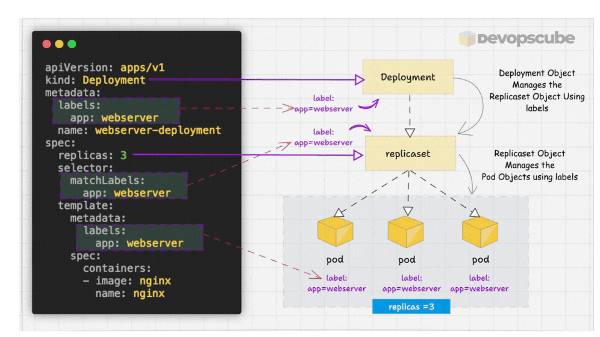
</p>

### Deployment Strategy Types

**RollingUpdate (default):**
```yaml
spec:
  strategy:
    type: RollingUpdate
    rollingUpdate:
      maxSurge: 1          # extra pods allowed during update
      maxUnavailable: 0    # min pods that must remain available
```

**Recreate:**
```yaml
spec:
  strategy:
    type: Recreate   # kills all pods, then creates new ones (downtime)
```

### Rollout Commands

```bash
kubectl rollout status deployment/<name>
kubectl rollout history deployment/<name>
kubectl rollout undo deployment/<name>
kubectl rollout undo deployment/<name> --to-revision=<n>
kubectl rollout pause deployment/<name>
kubectl rollout resume deployment/<name>
```

### Update Image

```bash
kubectl set image deployment/<name> <container>=<new-image>
# Example:
kubectl set image deployment/webapp nginx=nginx:1.26
```

---

## Scheduling

> 👉 **Deep Dive Lesson:** [Scheduler](https://courses.devopscube.com/courses/certified-kubernetes-administrator-course/lectures/58086840)

### How the Scheduler Works

<p align="center">
  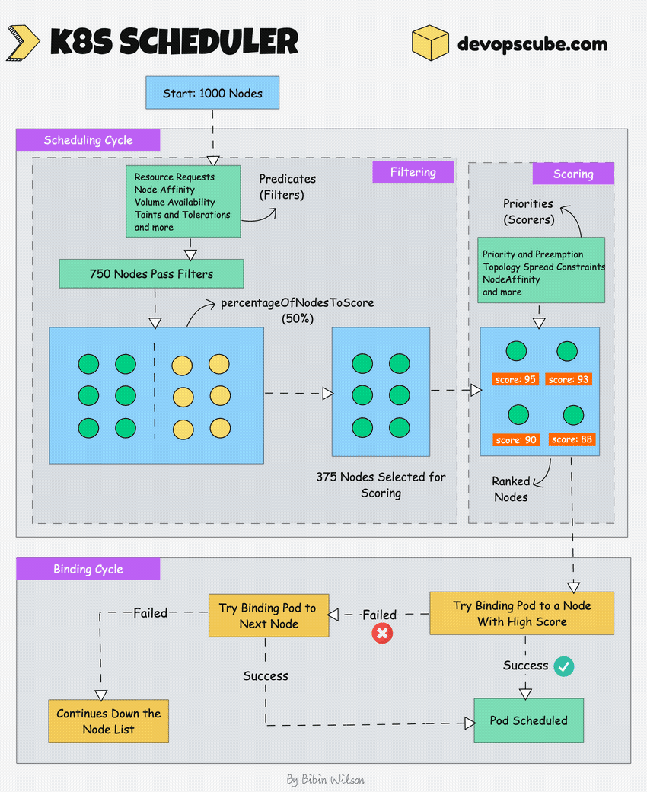
</p>

1. **Filtering:** Remove nodes that don't meet requirements (resources, taints, affinity)
2. **Scoring:** Rank remaining nodes (least utilized, image locality, etc.)
3. **Binding:** Assign pod to winning node


## Resource Requests vs Limits

> 👉 **Deep Dive Lesson:** [Resource Requests vs Limits](https://courses.devopscube.com/courses/certified-kubernetes-administrator-course/lectures/55682021)

<p align="center">
  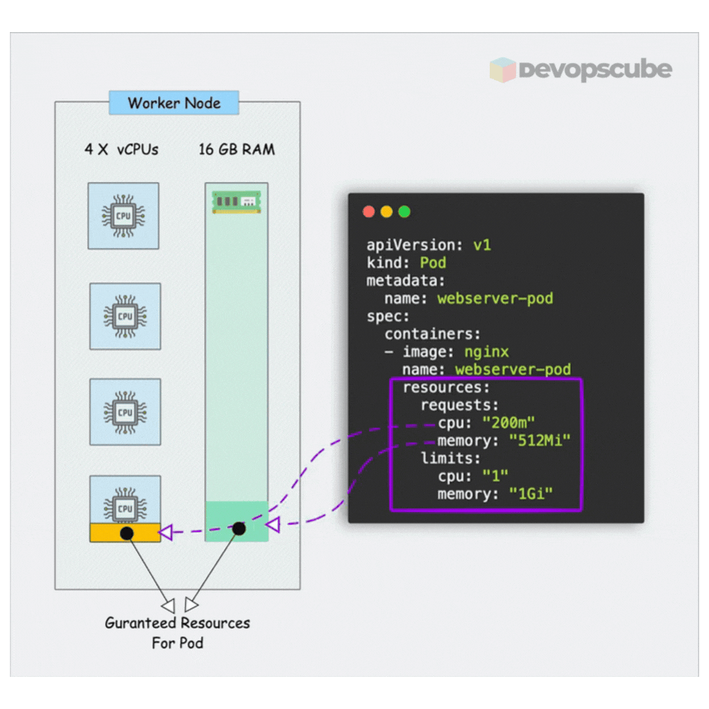
</p>

| | Request | Limit |
|--|---------|-------|
| **Purpose** | What the pod *needs* (used for scheduling) | Maximum the pod *can use* |
| **Effect** | Scheduler reserves this capacity on a node | Exceeded CPU → throttled; exceeded memory → OOMKilled |

```yaml
resources:
  requests:
    cpu: "250m"      # 0.25 cores
    memory: "128Mi"
  limits:
    cpu: "500m"
    memory: "256Mi"
```

### Quality of Service (QoS) Classes

| Class | Condition |
|-------|-----------|
| `Guaranteed` | requests == limits for all containers |
| `Burstable` | At least one container has requests set |
| `BestEffort` | No requests or limits set (evicted first under pressure) |

---

### Node Name & Node Selector 

> 👉 **Deep Dive Lesson:** [Node Selector](https://courses.devopscube.com/courses/certified-kubernetes-administrator-course/lectures/55686799)


<p align="center">
  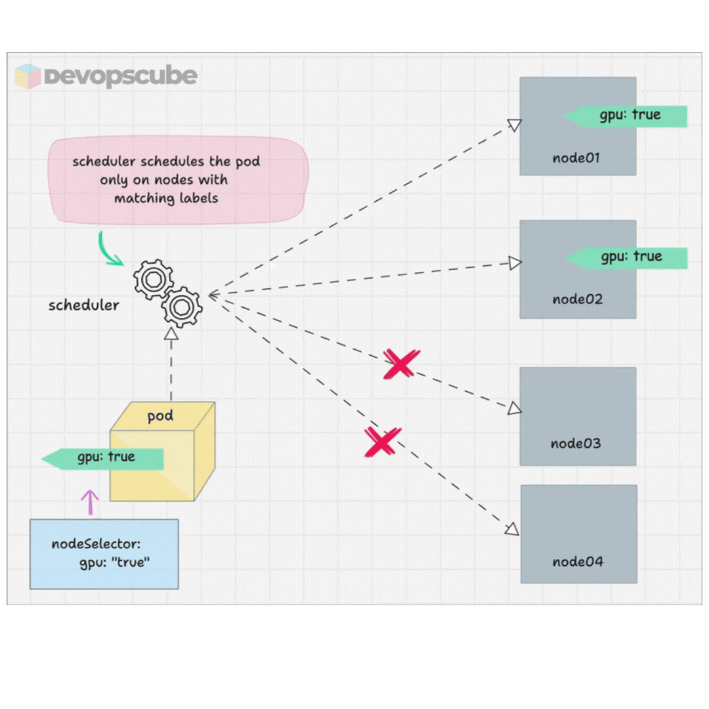
</p>

```yaml
spec:
  nodeSelector:
    gpu: "true"
```

```bash
kubectl label node node01 gpu="true"
```


## Node Affinity 

> 👉 **Deep Dive Lesson:** [Node Affinity](https://courses.devopscube.com/courses/certified-kubernetes-administrator-course/lectures/55687979)


<p align="center">
  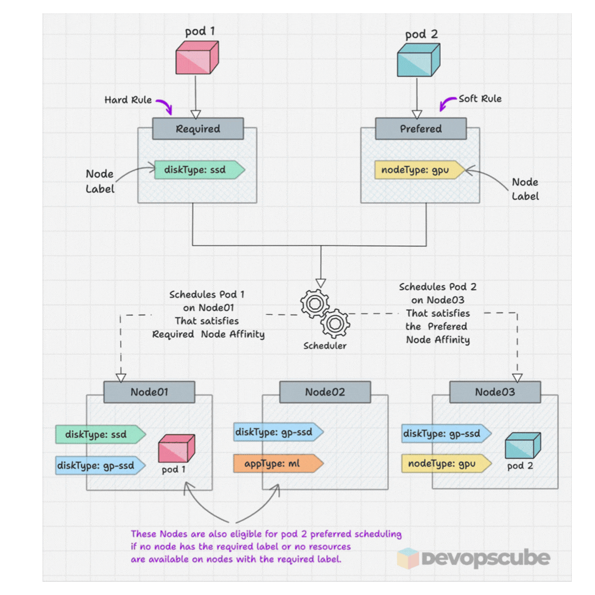
</p>

```yaml
spec:
  containers:
  - name: nginx
    image: nginx
  affinity:
    nodeAffinity:
      requiredDuringSchedulingIgnoredDuringExecution:
        nodeSelectorTerms:
        - matchExpressions:
          - key: diskType
            operator: In
            values:
            - ssd
      # Soft preference (scheduler prefers but not required)
     preferredDuringSchedulingIgnoredDuringExecution:
      - weight: 100
        preference:
          matchExpressions:
          - key: nodeType
            operator: In
            values:
            - gpu
```

### Pod Affinity & Anti-Affinity

```yaml
spec:
  affinity:
    podAffinity:
      # Co-locate with pods labeled app=cache
      requiredDuringSchedulingIgnoredDuringExecution:
      - labelSelector:
          matchLabels:
            app: cache
        topologyKey: kubernetes.io/hostname
    podAntiAffinity:
      # Don't co-locate replicas on same node
      preferredDuringSchedulingIgnoredDuringExecution:
      - weight: 100
        podAffinityTerm:
          labelSelector:
            matchLabels:
              app: web
          topologyKey: kubernetes.io/hostname
```

## Taints & Tolerations

> 👉 **Deep Dive Lesson:** [Taints & Tolerations](https://courses.devopscube.com/courses/certified-kubernetes-administrator-course/lectures/55659898)


<p align="center">
  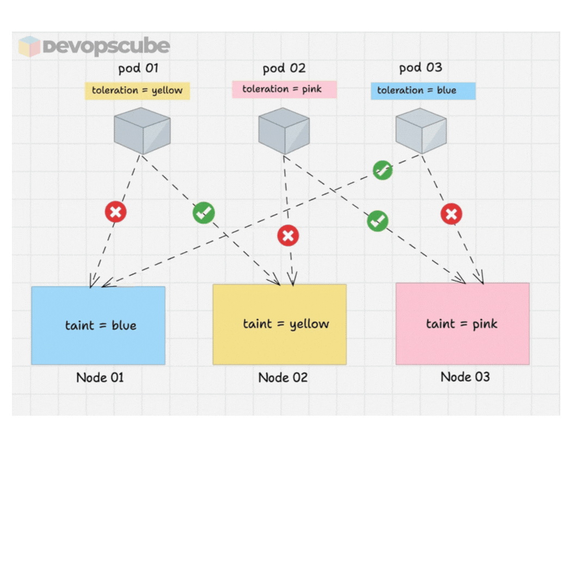
</p>  

**Taints** on nodes prevent pods from scheduling there (unless they tolerate).

```bash
# Effects:
# NoSchedule        → New pods without toleration won't schedule
# PreferNoSchedule  → Avoid scheduling but not required
# NoExecute         → Evict existing pods + prevent new ones
```

```yaml
# Toleration in pod spec:
spec:
  tolerations:
  - key: "gpu"
    operator: "Equal"
    value: "true"
    effect: "NoSchedule"
  # Tolerate any taint with effect NoSchedule:
  - operator: "Exists"
    effect: "NoSchedule"
```

---

## ConfigMaps & Secrets

> 👉 **Deep Dive Lesson:** [ConfigMaps](https://courses.devopscube.com/courses/certified-kubernetes-administrator-course/lectures/55993034)


<p align="center">
  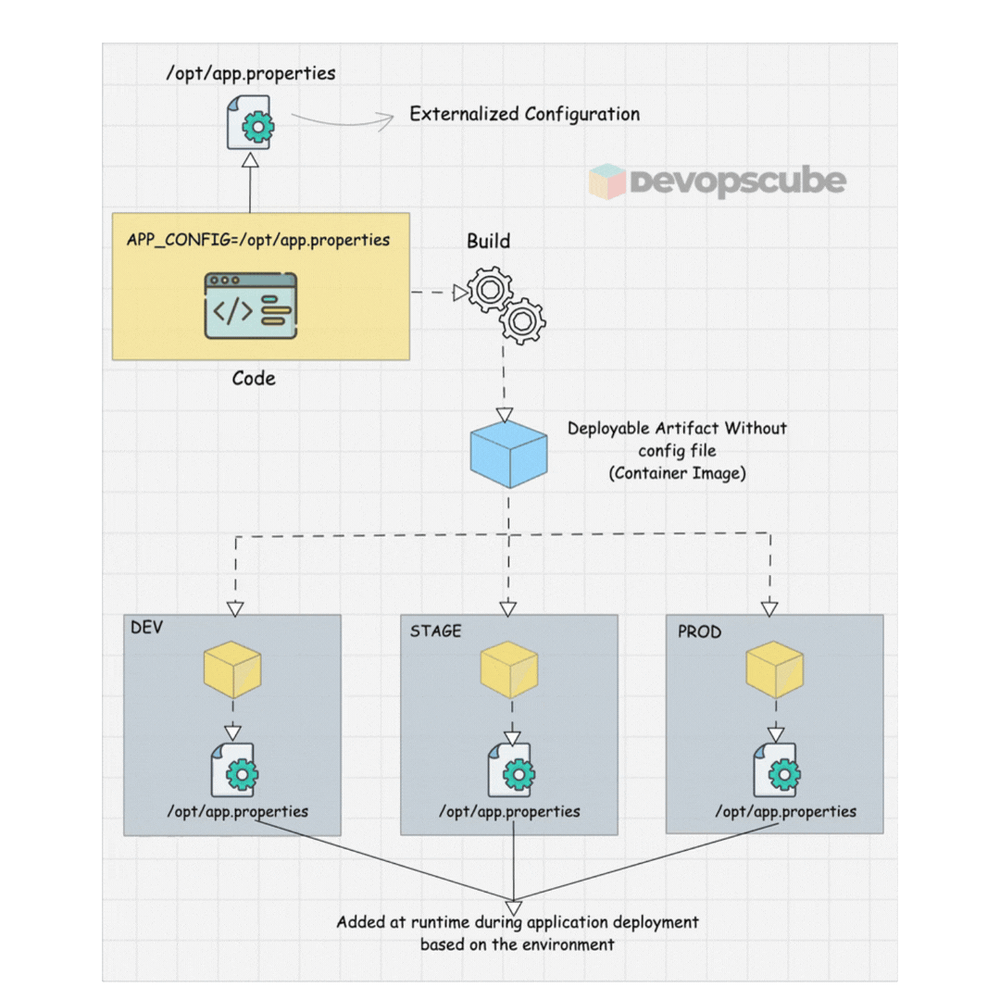
</p>  

### ConfigMap Usage Patterns

```yaml
# 1. As environment variables
envFrom:
- configMapRef:
    name: app-config

# 2. As specific env var
env:
- name: PORT
  valueFrom:
    configMapKeyRef:
      name: app-config
      key: PORT

# 3. As mounted file
volumes:
- name: config-vol
  configMap:
    name: app-config
containers:
- volumeMounts:
  - name: config-vol
    mountPath: /etc/config
```

> 👉 **Deep Dive Lesson:** [Secrets](https://courses.devopscube.com/courses/certified-kubernetes-administrator-course/lectures/55993473)


<p align="center">
  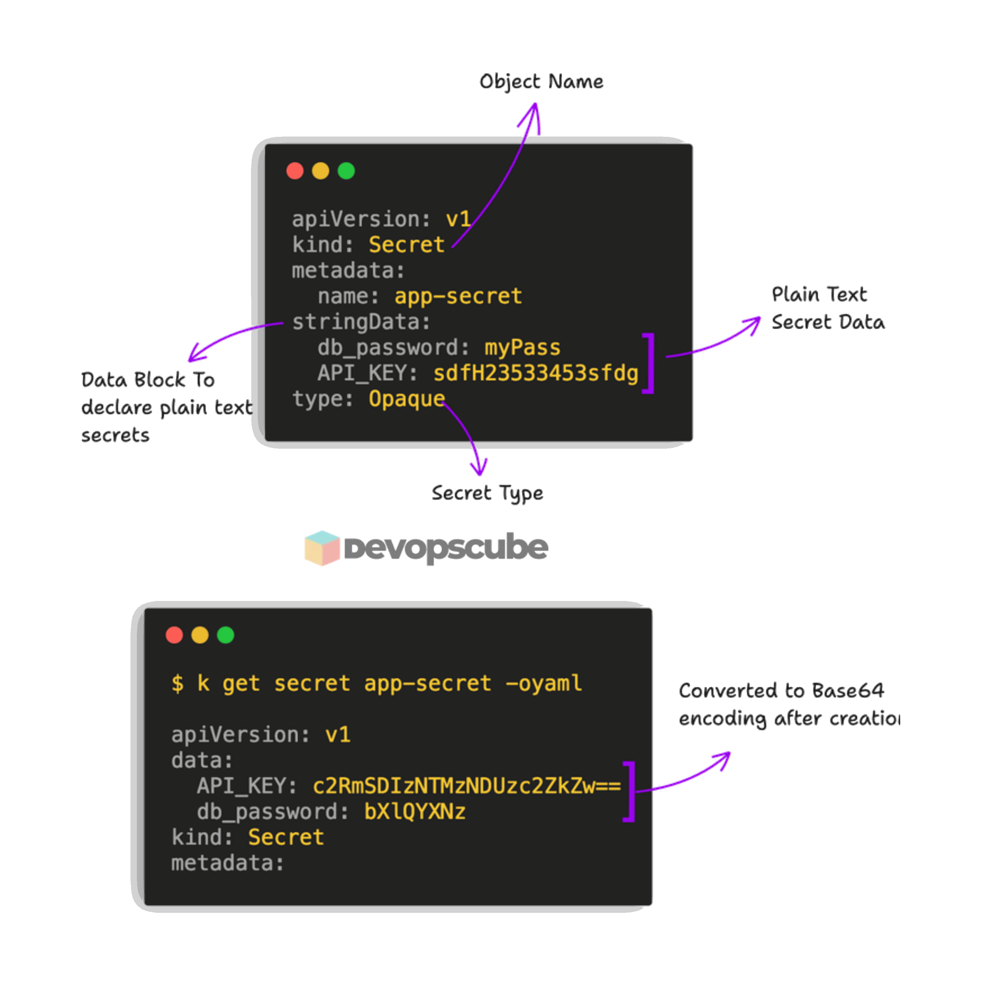
</p>  

### Secret Types

| Type | Use |
|------|-----|
| `Opaque` | Generic key-value (default) |
| `kubernetes.io/tls` | TLS cert and key |
| `kubernetes.io/dockerconfigjson` | Registry auth |
| `kubernetes.io/service-account-token` | SA tokens |

**Note:** Secrets are base64-encoded, not encrypted by default. Use EncryptionConfiguration for encryption at rest.

---

### Health Probes

| Probe | Purpose | What Happens on Failure |
|-------|---------|------------------------|
| `livenessProbe` | Is the container alive? | Container is restarted |
| `readinessProbe` | Is the container ready for traffic? | Pod removed from Service endpoints |
| `startupProbe` | Has the app finished starting? | Liveness/readiness disabled until it passes |

```yaml
livenessProbe:
  httpGet:
    path: /healthz
    port: 8080
  initialDelaySeconds: 15
  periodSeconds: 20
  failureThreshold: 3

readinessProbe:
  exec:
    command: ["cat", "/tmp/ready"]
  initialDelaySeconds: 5
  periodSeconds: 5

startupProbe:
  httpGet:
    path: /started
    port: 8080
  failureThreshold: 30
  periodSeconds: 10
```

---

## Init Containers

> 👉 **Deep Dive Lesson:** [Init Containers](https://courses.devopscube.com/courses/certified-kubernetes-administrator-course/lectures/55993474)


<p align="center">
  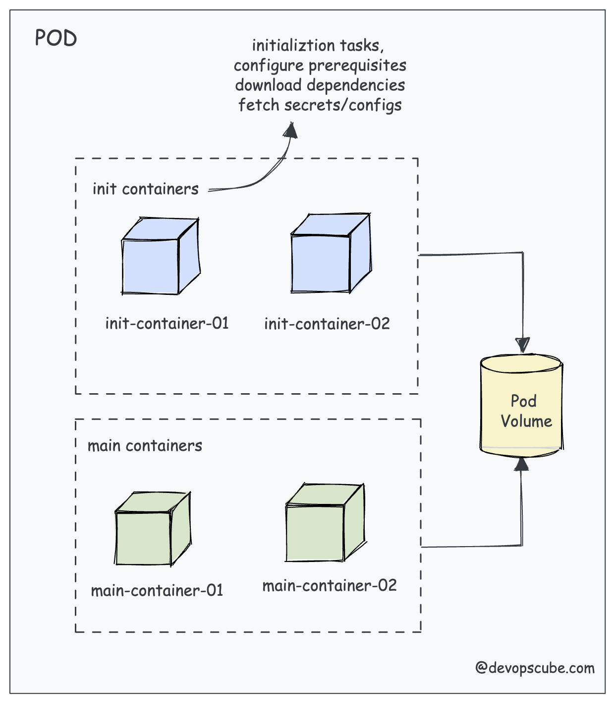
</p>  


- Run to completion **before** main containers start
- Run sequentially (not in parallel)
- Use cases: wait for dependencies, pre-populate data, run setup scripts

```yaml
spec:
  initContainers:
  - name: wait-for-db
    image: busybox
    command: ['sh', '-c', 'until nc -z db 5432; do sleep 2; done']
  containers:
  - name: app
    image: myapp
```

---

## Static Pods

> 👉 **Deep Dive Lesson:** [Static Pods](https://courses.devopscube.com/courses/certified-kubernetes-administrator-course/lectures/55279551)


<p align="center">
  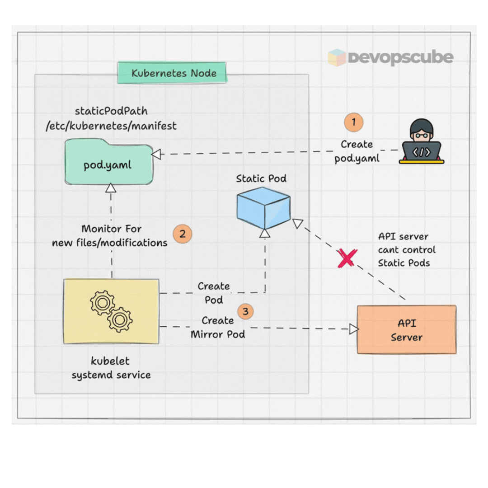
</p>  

- Managed directly by `kubelet` on a node (not by the API server)
- Manifests stored at `staticPodPath` in kubelet config (default: `/etc/kubernetes/manifests/`)
- Control plane components (apiserver, etcd, etc.) are static pods
- Changes take effect immediately when manifest is saved
- Shown in `kubectl get pods -n kube-system` as `<name>-<nodename>`

```bash
# Find staticPodPath
cat /var/lib/kubelet/config.yaml | grep staticPodPath
```

---

## Pod Priority & Preemption

> 👉 **Deep Dive Lesson:** [Pod Priority & Preemption](https://courses.devopscube.com/courses/certified-kubernetes-administrator-course/lectures/60175740)


<p align="center">
  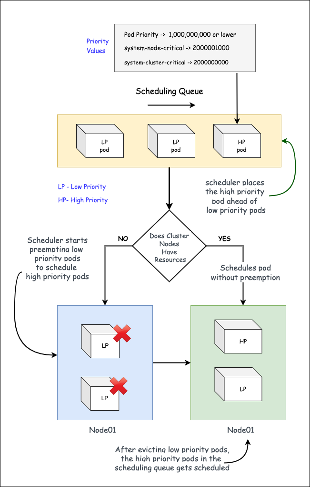
</p>  

```yaml
# 1. Create PriorityClass
apiVersion: scheduling.k8s.io/v1
kind: PriorityClass
metadata:
  name: high-priority
value: 1000000
globalDefault: false
description: "High priority workloads"

# 2. Reference in pod
spec:
  priorityClassName: high-priority
```

Higher priority pods can **preempt** (evict) lower priority pods when resources are tight.

---

## HorizontalPodAutoscaler (HPA)

> 👉 **Deep Dive Lesson:** [Horizontal Pod Autoscaler](https://courses.devopscube.com/courses/certified-kubernetes-administrator-course/lectures/61061646)


<p align="center">
  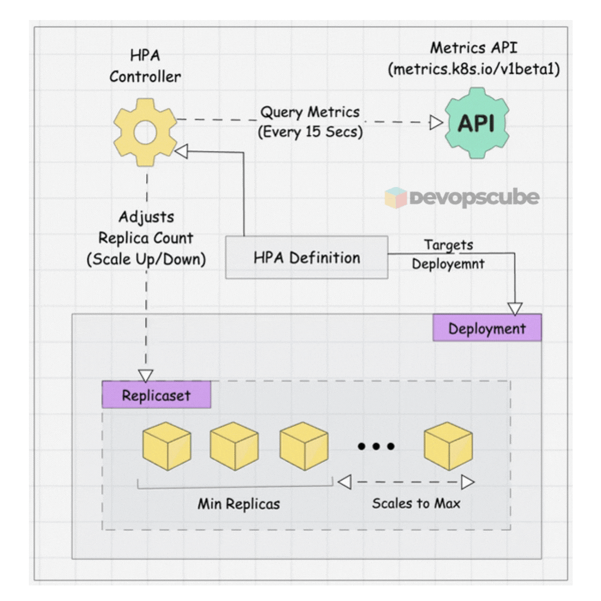
</p>  

```bash
kubectl autoscale deployment <name> \
  --cpu-percent=50 \
  --min=2 \
  --max=10
```

- Requires `metrics-server` to be installed
- Scales based on CPU/memory utilization or custom metrics
- Evaluation interval: 15 seconds (default)

---

## Admission Controllers

Intercept API requests before they're persisted to ETCD:

| Controller | Purpose |
|------------|---------|
| `NamespaceLifecycle` | Prevents operations on terminating namespaces |
| `LimitRanger` | Enforces resource limits in a namespace |
| `ResourceQuota` | Limits total resource usage per namespace |
| `PodSecurity` | Enforces pod security standards |
| `MutatingAdmissionWebhook` | Modifies objects (e.g., inject sidecar) |
| `ValidatingAdmissionWebhook` | Validates objects (custom rules) |

---

## Exam Focus Points

1. **Deployment updates & rollbacks** -> Very commonly tested
2. **ConfigMaps and Secrets** -> Know all 3 usage patterns
3. **Resource limits** -> Know requests vs limits difference
4. **Taints & Tolerations** -> Know all 3 effects
5. **Node Affinity** -> Know required vs preferred syntax
6. **Static pods** -> Know how to create/modify them

---

*Previous: [Cluster Architecture](./01-cluster-architecture.md)*
*Next: [Storage](./03-storage.md)*
