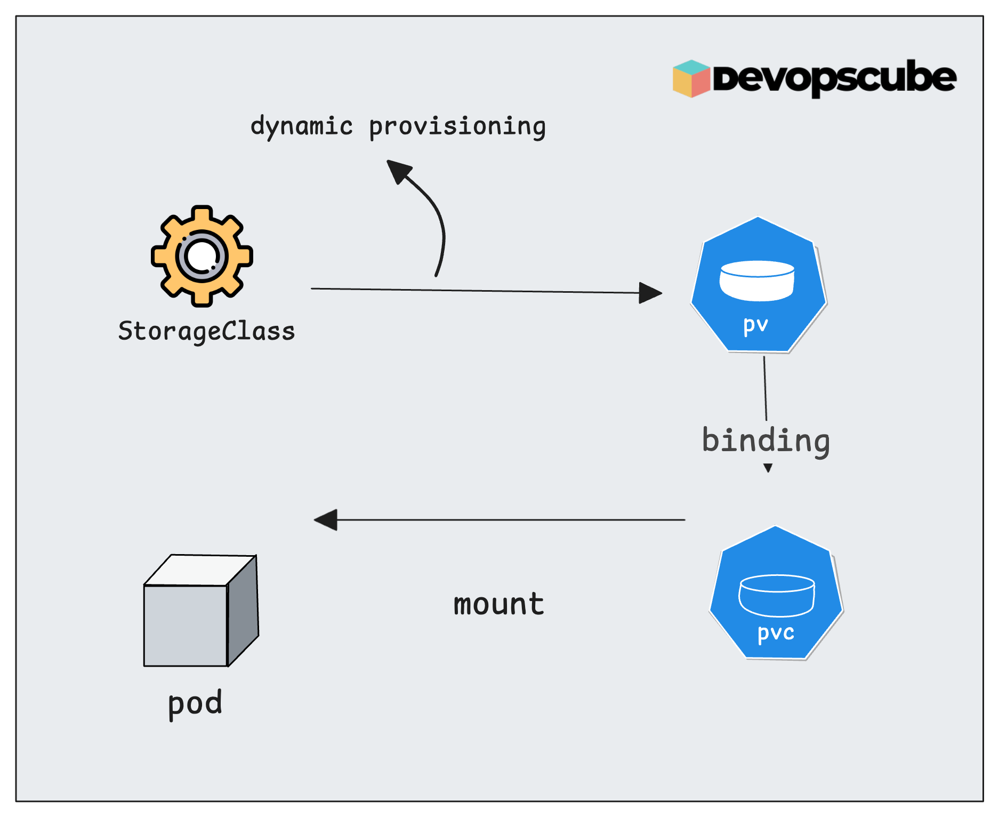
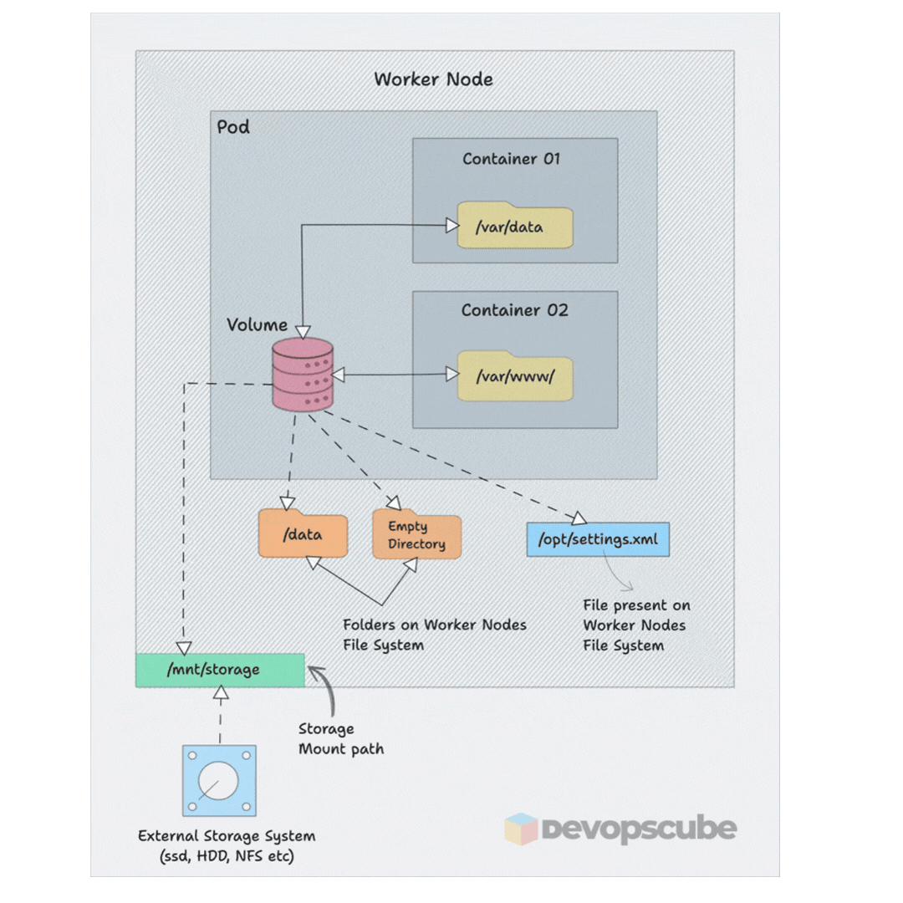
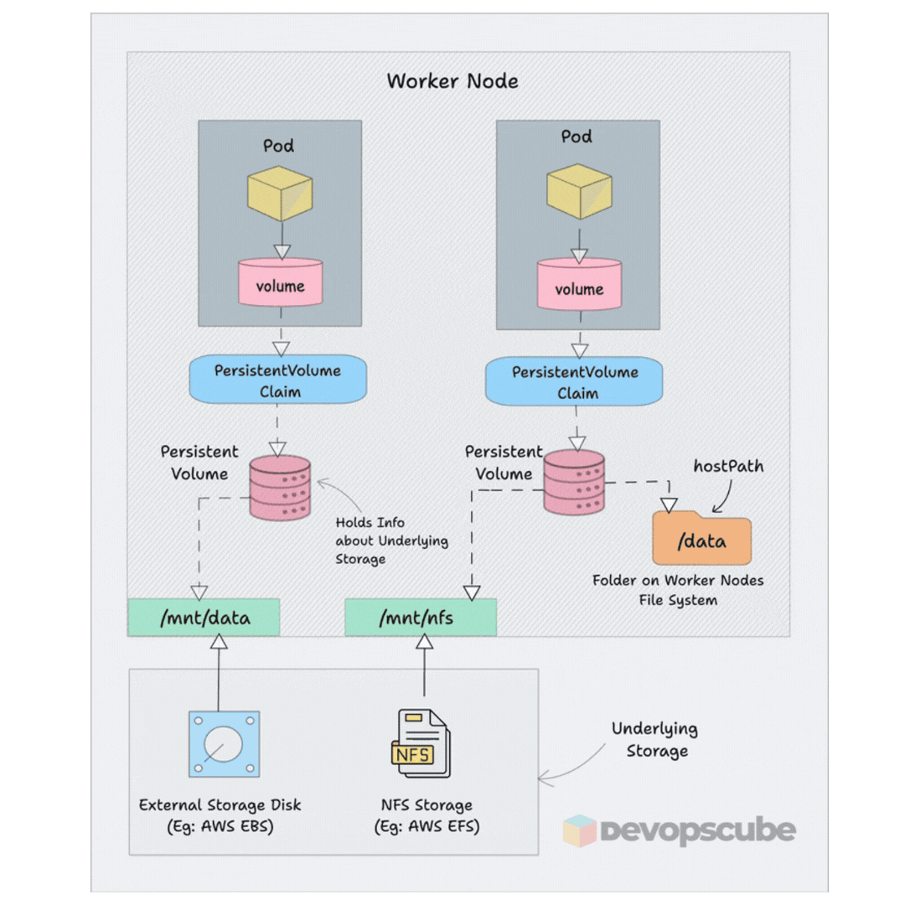
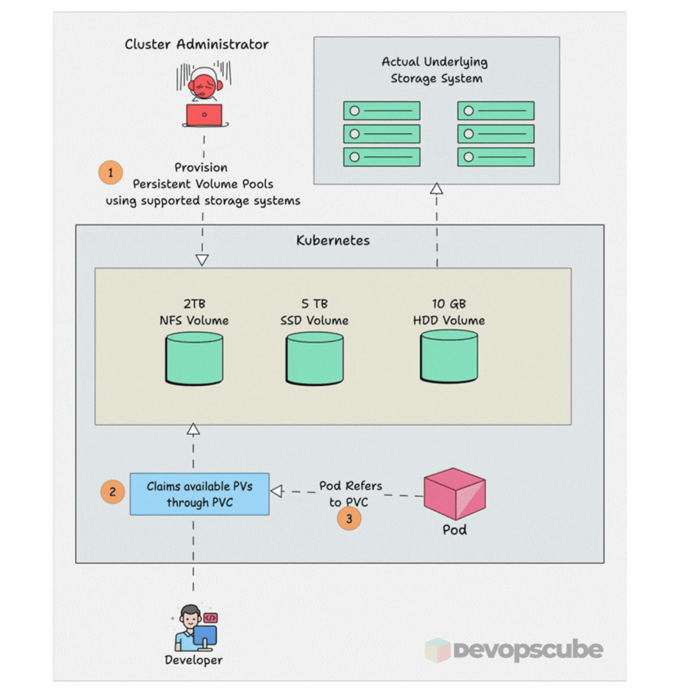

# Kubernetes Storage for CKA — PV, PVC, StorageClasses & Dynamic Provisioning (10%)

> **Exam Weight: 10%** -> Focus on PV/PVC lifecycle, StorageClasses, and volume types.

**Q: Why is my Kubernetes PVC stuck in Pending state?**

A: Three common causes: (1) No PersistentVolume matches the PVC's `storageClassName`, `accessMode`, or capacity — run `kubectl get pv` to check; (2) The StorageClass doesn't exist — `kubectl get sc`; (3) The dynamic provisioner isn't running — `kubectl get pods -n kube-system | grep provisioner`.

**Q: What is the difference between ReadWriteOnce, ReadOnlyMany, and ReadWriteMany in Kubernetes?**

A: `ReadWriteOnce (RWO)` — mounted read-write by a single node. `ReadOnlyMany (ROX)` — mounted read-only by many nodes. `ReadWriteMany (RWX)` — mounted read-write by many nodes simultaneously. Most cloud block storage (AWS EBS, GCP PD) only supports RWO.

---

## Index

1. [Storage Hierarchy](#storage-hierarchy)
2. [Kubernetes Volumes](#kubernetes-volumes)
3. [PersistentVolumes (PV)](#persistentvolumes-pv)
4. [PersistentVolumeClaims (PVC)](#persistentvolumeclaims-pvc)
5. [StorageClasses](#storageclasses)
6. [Using PVC in a Pod](#using-pvc-in-a-pod)
7. [Volume Expansion](#volume-expansion)
8. [Ephemeral Volumes](#ephemeral-volumes)
9. [CSI (Container Storage Interface)](#csi-container-storage-interface)
10. [Troubleshooting Storage](#troubleshooting-storage)
11. [Exam Focus Points](#exam-focus-points)

---

## Storage Hierarchy

  

 

## Kubernetes Volumes

> 👉 **Deep Dive Lesson:** [Kubernetes Volumes](https://courses.devopscube.com/courses/certified-kubernetes-administrator-course/lectures/55791431)


<p align="center">
  
</p>

### Volume Types

| Type | Description | Persistence |
|------|-------------|------------|
| `emptyDir` | Temporary dir, created when pod starts | Pod lifetime |
| `hostPath` | Mount a path from the host node | Node lifetime |
| `configMap` | Mount ConfigMap as files | N/A |
| `secret` | Mount Secret as files | N/A |
| `persistentVolumeClaim` | Use a PVC for persistent storage | Beyond pod lifetime |
| `nfs` | Network File System mount | External |
| `awsElasticBlockStore` | AWS EBS volume | External |
| `gcePersistentDisk` | GCP persistent disk | External |

### emptyDir Example

```yaml
volumes:
- name: scratch
  emptyDir: {}

# With memory backing (faster, uses RAM):
- name: cache
  emptyDir:
    medium: Memory
    sizeLimit: 500Mi
```

### hostPath Example

```yaml
volumes:
- name: host-vol
  hostPath:
    path: /tmp/data
    type: DirectoryOrCreate  # creates if not exists
```

**hostPath types:** `Directory`, `DirectoryOrCreate`, `File`, `FileOrCreate`, `Socket`, `CharDevice`, `BlockDevice`

---

## PersistentVolumes (PV)

> 👉 **Deep Dive Lesson:** [Persistent Volumes](https://courses.devopscube.com/courses/certified-kubernetes-administrator-course/lectures/55792087)

<p align="center">
  
</p>

### Access Modes

| Mode | Short | Description |
|------|-------|-------------|
| `ReadWriteOnce` | RWO | One node can mount read-write |
| `ReadOnlyMany` | ROX | Many nodes can mount read-only |
| `ReadWriteMany` | RWX | Many nodes can mount read-write |
| `ReadWriteOncePod` | RWOP | Only one pod cluster-wide |

**Important:** Not all volume types support all access modes. `hostPath` and `awsEBS` are RWO only. `NFS` supports RWX.

### Reclaim Policies

| Policy | Behavior When PVC is Deleted |
|--------|------------------------------|
| `Retain` | PV is kept (status: Released); manual cleanup needed |
| `Delete` | PV and underlying storage are deleted |
| `Recycle` | *(Deprecated)* Data wiped with `rm -rf`, PV made available again |

### PV Status Phases

| Phase | Meaning |
|-------|---------|
| `Available` | Ready to be bound to a PVC |
| `Bound` | Bound to a PVC |
| `Released` | PVC deleted, but PV not yet reclaimed |
| `Failed` | Automatic reclamation failed |

### PV Example

```yaml
apiVersion: v1
kind: PersistentVolume
metadata:
  name: pv-example
spec:
  capacity:
    storage: 5Gi
  accessModes:
    - ReadWriteOnce
  persistentVolumeReclaimPolicy: Retain
  storageClassName: slow
  hostPath:
    path: /mnt/data
```

---

## PersistentVolumeClaims (PVC)

> 👉 **Deep Dive Lesson:** [Persistent Volumes Claims](https://courses.devopscube.com/courses/certified-kubernetes-administrator-course/lectures/55792087)

<p align="center">
  
</p>

- PVC is a **request** for storage
- Kubernetes binds a PVC to a PV that satisfies all requirements
- A PVC binds to **one PV** only

### Binding Rules

A PVC binds to a PV if ALL of these match:
1. `storageClassName` matches (or both are empty)
2. `accessModes` are compatible
3. `capacity` is sufficient (PV must be >= PVC request)
4. `selector` (if specified) matches PV labels

### PVC Example

```yaml
apiVersion: v1
kind: PersistentVolumeClaim
metadata:
  name: my-pvc
  namespace: default
spec:
  storageClassName: slow
  accessModes:
    - ReadWriteOnce
  resources:
    requests:
      storage: 2Gi
```

---

## StorageClasses

> 👉 **Deep Dive Lesson:** [Storage Classes](https://courses.devopscube.com/courses/certified-kubernetes-administrator-course/lectures/55786335)

<p align="center">
  
</p>

StorageClasses enable **dynamic provisioning** — PVs are automatically created when a PVC is created.

```yaml
apiVersion: storage.k8s.io/v1
kind: StorageClass
metadata:
  name: fast
  annotations:
    storageclass.kubernetes.io/is-default-class: "true"  # set as default
provisioner: kubernetes.io/aws-ebs
parameters:
  type: gp2
  fsType: ext4
reclaimPolicy: Delete
allowVolumeExpansion: true
volumeBindingMode: WaitForFirstConsumer  # or Immediate
```

### volumeBindingMode

| Mode | Behavior |
|------|----------|
| `Immediate` | PV provisioned immediately when PVC is created |
| `WaitForFirstConsumer` | PV provisioned when a pod using the PVC is scheduled |

`WaitForFirstConsumer` is preferred for topology-aware storage (e.g., cloud zones).

---

## Using PVC in a Pod

```yaml
apiVersion: v1
kind: Pod
metadata:
  name: storage-pod
spec:
  volumes:
  - name: data-vol
    persistentVolumeClaim:
      claimName: my-pvc
  containers:
  - name: app
    image: nginx
    volumeMounts:
    - name: data-vol
      mountPath: /usr/share/nginx/html
      readOnly: false
```

---

## Volume Expansion

To expand a PVC (if StorageClass has `allowVolumeExpansion: true`):

```bash
# Edit the PVC storage request
kubectl edit pvc my-pvc
# Change: storage: 2Gi → storage: 5Gi
```

---

## Ephemeral Volumes

For temporary data that doesn't need to outlive a pod but is more controlled than `emptyDir`:

```yaml
spec:
  volumes:
  - name: ephemeral-vol
    ephemeral:
      volumeClaimTemplate:
        spec:
          accessModes: [ReadWriteOnce]
          resources:
            requests:
              storage: 1Gi
```

---

## CSI (Container Storage Interface)

CSI drivers enable external storage systems to integrate with Kubernetes:

- AWS EBS CSI driver
- GCP Persistent Disk CSI driver
- Azure Disk CSI driver
- NFS CSI driver

Installed as pods in the cluster, exposes storage via StorageClass.

---

## Troubleshooting Storage

### PVC Stuck in Pending

```bash
kubectl describe pvc <name>

# Check:
# 1. Is there a matching PV? (capacity, accessMode, storageClass)
kubectl get pv

# 2. Does the StorageClass exist?
kubectl get storageclass

# 3. Is the dynamic provisioner running?
kubectl get pods -n kube-system | grep provisioner
```

### Pod Can't Mount Volume

```bash
kubectl describe pod <name>
# Look for FailedMount events

# Check if PVC is bound
kubectl get pvc

# Check if PV status is Bound
kubectl get pv
```

---

## Exam Focus Points

1. **PV/PVC creation and binding** -> Know the binding rules (storageClass, accessMode, capacity)
2. **Access modes** -> RWO vs RWX and what supports each
3. **Reclaim policies** -> Retain vs Delete
4. **StorageClass** -> Know how dynamic provisioning works
5. **Mounting PVC in a pod** -> volumes + volumeMounts pattern

---

*Previous: [Workloads & Scheduling](./02-workloads-scheduling.md)*
*Next: [Services & Networking](./04-services-networking.md)*
