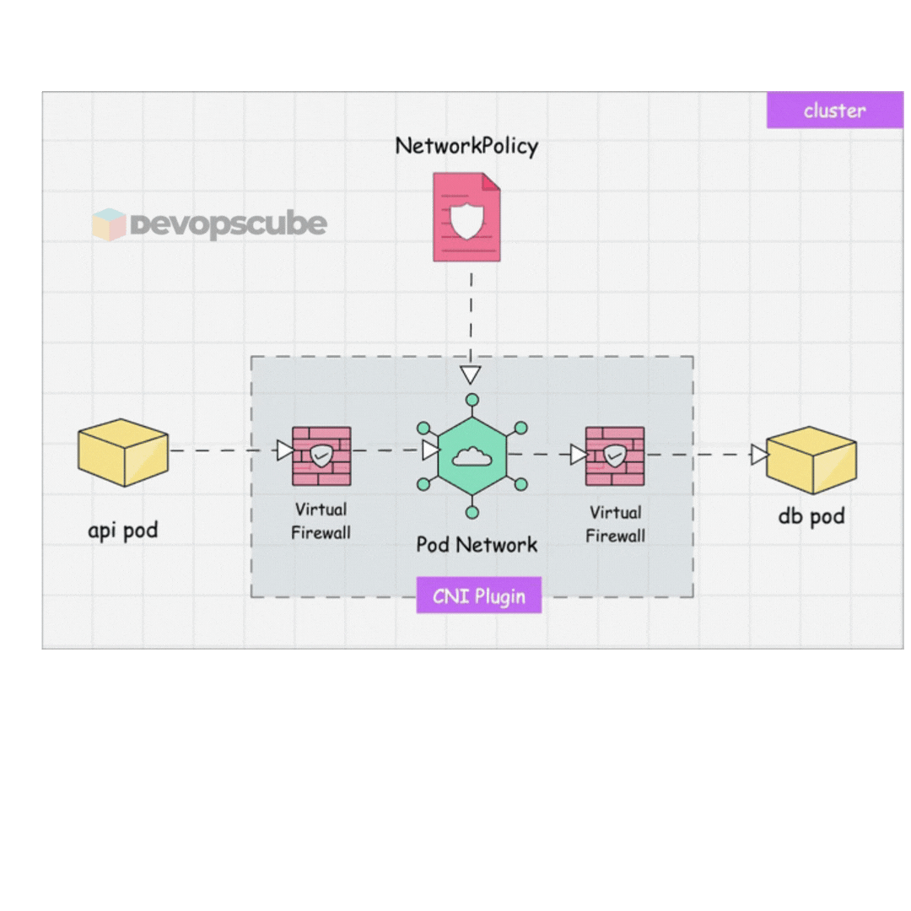
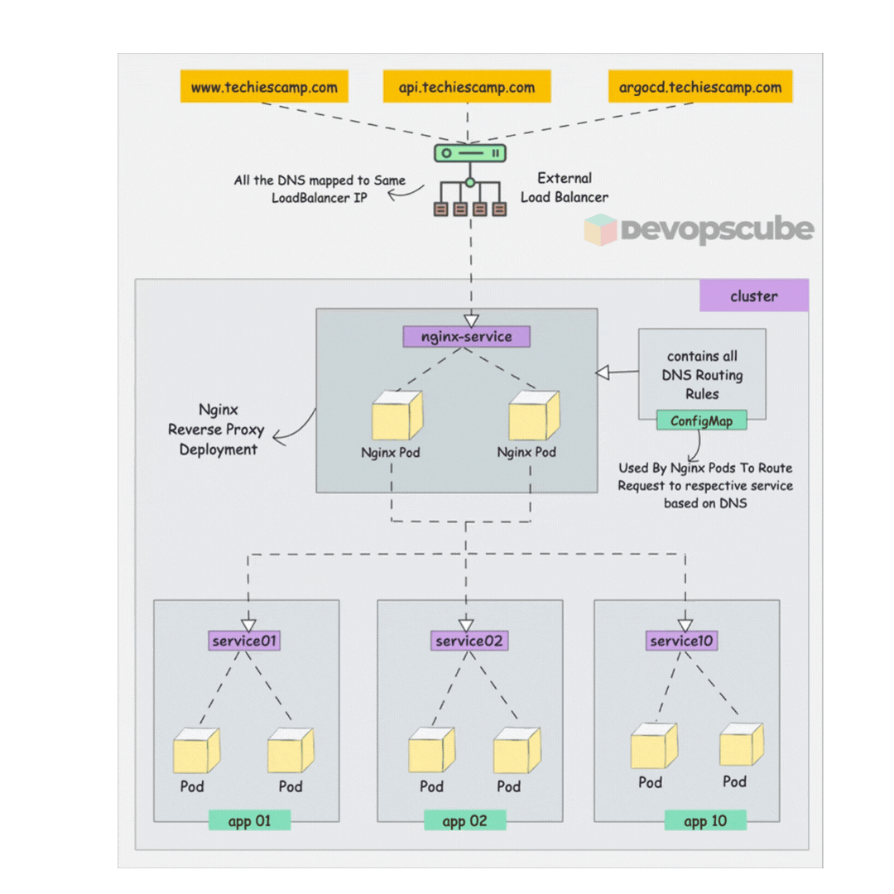
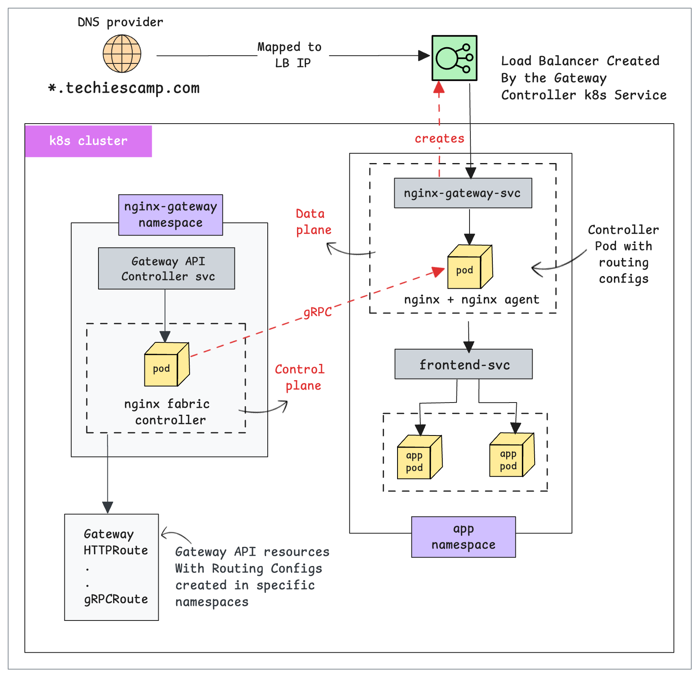
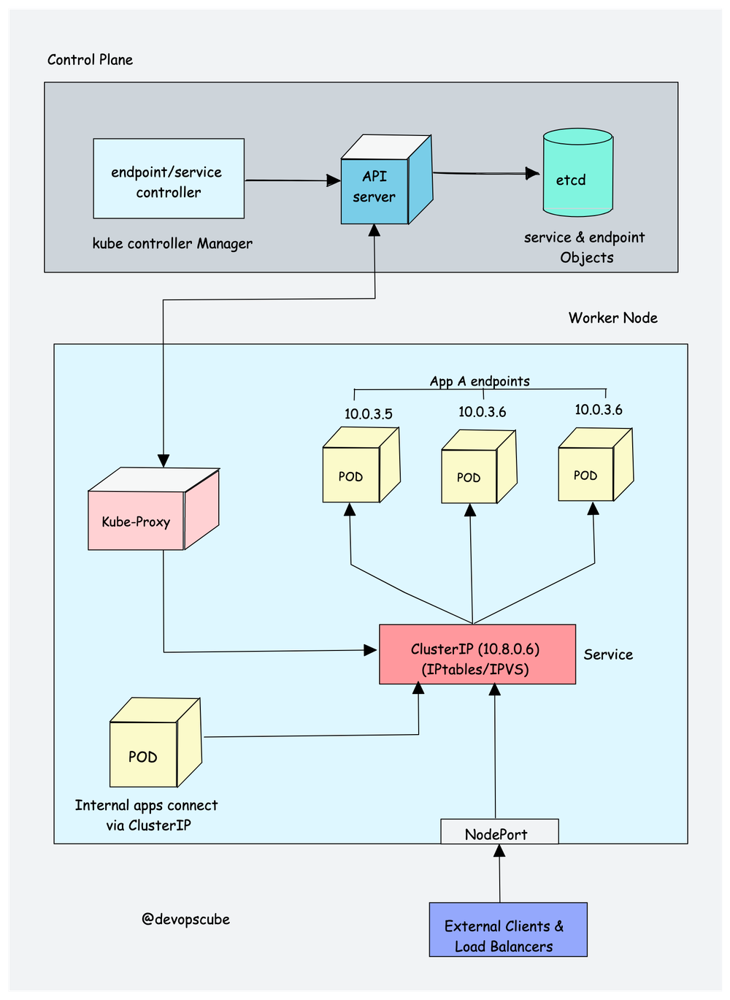

# Services & Networking

> **Exam Weight: 20%** — Focus on Services, Network Policies, Ingress, and DNS.

---

## Index

1. [Kubernetes Networking Model](#kubernetes-networking-model)
2. [Services](#services)
3. [DNS in Kubernetes](#dns-in-kubernetes)
4. [Network Policies](#network-policies)
5. [Ingress](#ingress)
6. [Gateway API](#gateway-api)
7. [CoreDNS Configuration](#coredns-configuration)
8. [kube-proxy Modes](#kube-proxy-modes)
9. [Exam Focus Points](#exam-focus-points)

---

## Kubernetes Networking Model


### Core Principles

1. Every pod gets its own IP address
2. Pods on any node can communicate with any other pod without NAT
3. Agents on a node (kubelet, kube-proxy) can communicate with all pods on that node
4. Pods can communicate with Services using DNS

### Network Flow

<p align="center">
  
</p>


---

## Services

> 👉 **Deep Dive Lesson:** [Services](https://courses.devopscube.com/courses/certified-kubernetes-administrator-course/lectures/55809546)

Services provide stable endpoints for pods (which have ephemeral IPs).

### Service Types

| Type | Description | Access |
|------|-------------|--------|
| `ClusterIP` (default) | Internal cluster IP, only accessible within cluster | Internal |
| `NodePort` | Exposes service on a static port on each node | External via `NodeIP:NodePort` |
| `LoadBalancer` | Provisions an external load balancer (cloud) | External via LB IP |
| `ExternalName` | Maps service to a DNS name (no proxying) | DNS alias |

### ClusterIP

```yaml
apiVersion: v1
kind: Service
metadata:
  name: my-svc
spec:
  selector:
    app: my-app
  ports:
  - protocol: TCP
    port: 80         # Service port
    targetPort: 8080 # Pod port
  type: ClusterIP
```

### NodePort

```yaml
spec:
  type: NodePort
  ports:
  - port: 80
    targetPort: 8080
    nodePort: 30080  # 30000-32767 range
```

### How Services Find Pods

The **selector** in the Service must match **labels** on the pods:

```yaml
# Service
spec:
  selector:
    app: backend      # must match pod labels
    tier: api

# Pod
metadata:
  labels:
    app: backend      # must match
    tier: api
```

```bash
# Verify endpoints are populated
kubectl get endpoints <svc-name>
# If empty → selector doesn't match pod labels
```

---

### DNS in Kubernetes

CoreDNS provides DNS resolution. All services and pods get DNS entries.

### DNS Name Formats

```
# Service DNS
<service-name>.<namespace>.svc.cluster.local
<service-name>.<namespace>.svc
<service-name>.<namespace>
<service-name>     # from same namespace

# Pod DNS (based on IP)
<pod-ip-dashes>.<namespace>.pod.cluster.local
# e.g., 10-244-1-5.default.pod.cluster.local
```

### DNS Resolution Order

Pods use `/etc/resolv.conf` which is configured by kubelet:
```
nameserver 10.96.0.10     # CoreDNS service IP
search default.svc.cluster.local svc.cluster.local cluster.local
```

### Test DNS

```bash
kubectl run dns-test --image=busybox --rm -it -- \
  nslookup kubernetes.default.svc.cluster.local

kubectl run dns-test --image=busybox --rm -it -- \
  nslookup <svc>.<ns>.svc.cluster.local
```

---

## Network Policies

> 👉 **Deep Dive Lesson:** [Network Policies](https://courses.devopscube.com/courses/certified-kubernetes-administrator-course/lectures/57421520)

By default, all pods can communicate with all other pods. Network Policies restrict this.

<p align="center">
  
</p>


### Key Concepts

- **podSelector**: Which pods this policy applies to
- **policyTypes**: `Ingress`, `Egress`, or both
- **ingress/egress rules**: What traffic is allowed

### Default Deny All (Ingress)

```yaml
apiVersion: networking.k8s.io/v1
kind: NetworkPolicy
metadata:
  name: default-deny-ingress
  namespace: production
spec:
  podSelector: {}     # applies to ALL pods in namespace
  policyTypes:
  - Ingress
  # No ingress rules = deny all ingress
```

### Default Deny All (Both)

```yaml
spec:
  podSelector: {}
  policyTypes:
  - Ingress
  - Egress
  # No rules = deny all
```

### Allow Specific Ingress

```yaml
spec:
  podSelector:
    matchLabels:
      app: backend
  policyTypes:
  - Ingress
  ingress:
  - from:
    - podSelector:           # from specific pods
        matchLabels:
          app: frontend
    - namespaceSelector:     # from specific namespace
        matchLabels:
          env: production
    ports:
    - protocol: TCP
      port: 3000
```

### Allow DNS Egress (When Using Default Deny)

```yaml
spec:
  podSelector: {}
  policyTypes:
  - Egress
  egress:
  - ports:
    - protocol: UDP
      port: 53
    - protocol: TCP
      port: 53
```

### Important: AND vs OR in from/to

```yaml
# AND — both conditions must be true (single list item)
from:
- podSelector:
    matchLabels: {app: frontend}
  namespaceSelector:
    matchLabels: {env: prod}

# OR — either condition is sufficient (separate list items)
from:
- podSelector:
    matchLabels: {app: frontend}
- namespaceSelector:
    matchLabels: {env: prod}
```

---

## Ingress

> 👉 **Deep Dive Lesson:** [Ingress](https://courses.devopscube.com/courses/certified-kubernetes-administrator-course/lectures/56659356)


<p align="center">
  
</p>

Ingress manages external HTTP/HTTPS access to services.

### Requirements

- An **Ingress Controller** must be installed (nginx, traefik, Istio, etc.)
- Then create **Ingress resources** to define routing rules

### Basic Ingress

```yaml
apiVersion: networking.k8s.io/v1
kind: Ingress
metadata:
  name: my-ingress
  annotations:
    nginx.ingress.kubernetes.io/rewrite-target: /
spec:
  ingressClassName: nginx
  rules:
  - host: myapp.example.com
    http:
      paths:
      - path: /api
        pathType: Prefix
        backend:
          service:
            name: api-svc
            port:
              number: 80
      - path: /
        pathType: Prefix
        backend:
          service:
            name: frontend-svc
            port:
              number: 80
```

### TLS Ingress

```yaml
spec:
  tls:
  - hosts:
    - myapp.example.com
    secretName: tls-secret   # must contain tls.crt and tls.key
  rules:
  - host: myapp.example.com
    ...
```

### Path Types

| Type | Behavior |
|------|----------|
| `Exact` | Exact URL match only |
| `Prefix` | Matches all paths starting with the prefix |
| `ImplementationSpecific` | Depends on the ingress controller |

---

## Gateway API 

> 👉 **Deep Dive Lesson:** [Gateway API](https://courses.devopscube.com/courses/certified-kubernetes-administrator-course/lectures/61100920)

<p align="center">
  
</p>

Gateway API is the successor to Ingress, with more features and better extensibility.

### Core Objects

| Object | Role |
|--------|------|
| `GatewayClass` | Defines the type of gateway (like IngressClass) |
| `Gateway` | An instance of a load balancer |
| `HTTPRoute` | Routing rules for HTTP traffic |
| `TCPRoute` | Routing rules for TCP traffic |
| `ReferenceGrant` | Allows cross-namespace references |

```yaml
# Gateway
apiVersion: gateway.networking.k8s.io/v1
kind: Gateway
metadata:
  name: my-gateway
spec:
  gatewayClassName: nginx
  listeners:
  - name: http
    port: 80
    protocol: HTTP

---
# HTTPRoute
apiVersion: gateway.networking.k8s.io/v1
kind: HTTPRoute
metadata:
  name: my-route
spec:
  parentRefs:
  - name: my-gateway
  hostnames: ["myapp.example.com"]
  rules:
  - matches:
    - path:
        type: PathPrefix
        value: /api
    backendRefs:
    - name: api-svc
      port: 80
```

---

### CoreDNS Configuration

> 👉 **Deep Dive Lesson:** [CoreDNS](https://courses.devopscube.com/courses/certified-kubernetes-administrator-course/lectures/55120286)

```bash
# View CoreDNS ConfigMap
kubectl get configmap coredns -n kube-system -o yaml
```

```
# Default Corefile
.:53 {
    errors
    health {
       lameduck 5s
    }
    ready
    kubernetes cluster.local in-addr.arpa ip6.arpa {
       pods insecure
       fallthrough in-addr.arpa ip6.arpa
       ttl 30
    }
    prometheus :9153
    forward . /etc/resolv.conf
    cache 30
    loop
    reload
    loadbalance
}
```

---

## kube-proxy Modes

> 👉 **Deep Dive Lesson:** [kube-proxy Modes](https://courses.devopscube.com/courses/certified-kubernetes-administrator-course/lectures/58129596)

<p align="center">
  
</p>


| Mode | How it Works |
|------|-------------|
| `iptables` (default) | Uses iptables rules for packet forwarding |
| `ipvs` | Uses IPVS (IP Virtual Server) — better for large clusters |
| `userspace` | Deprecated — poor performance |

---

## Exam Focus Points 
1. **Service selectors** — Know why endpoints might be empty and how to fix
2. **Network Policies** — Know default deny, allow by pod/namespace selector
3. **DNS format** — Know the full FQDN `<svc>.<ns>.svc.cluster.local`
4. **Ingress** — Know how to create an Ingress with host and path rules
5. **AND vs OR** in Network Policy `from` rules — a common exam trap

---

*Previous: [Storage](./03-storage.md)*
*Next: [Troubleshooting](./05-troubleshooting.md)*
