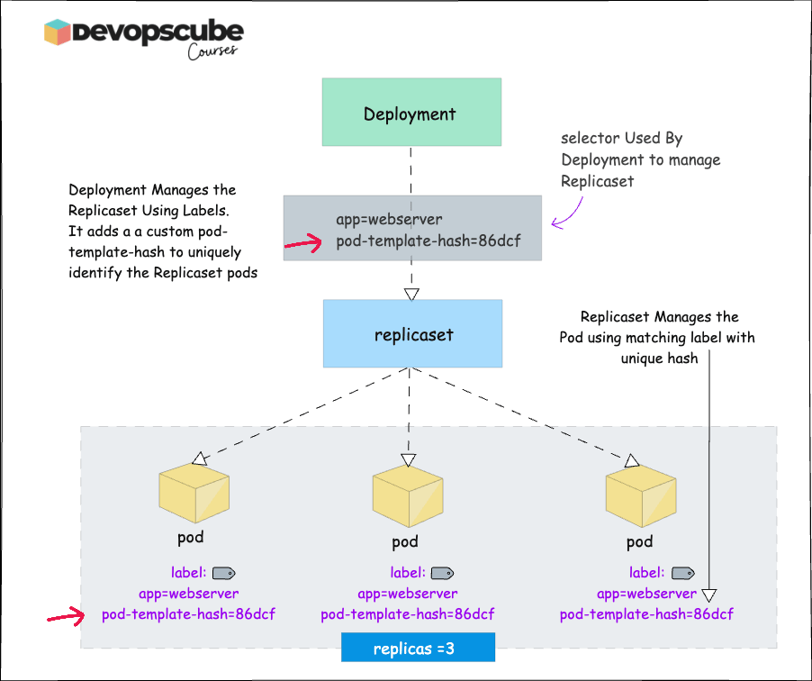
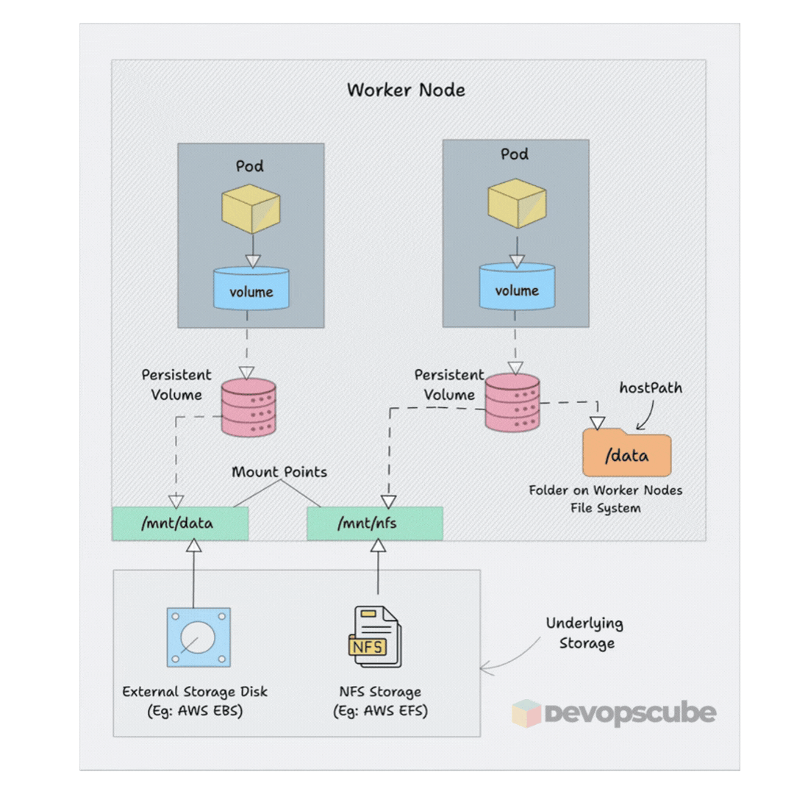
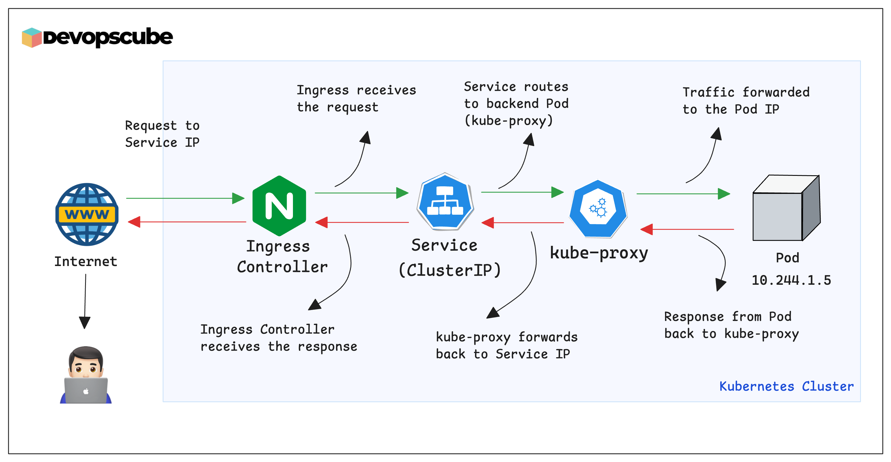
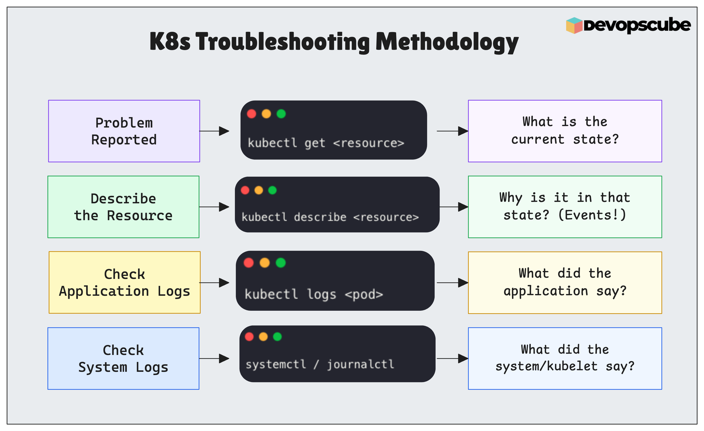

# CKA Study Notes — Visual Domain Guides with Architecture Diagrams (Kubernetes v1.35)

> **Kubernetes v1.35 · 2026 Edition**

Pass the CKA by building a **visual mental model first**, then reinforcing it with commands. Every topic in these notes is paired with an architecture diagram so you understand the **why** before you memorise the **how**.

**Q: Which CKA domain should I study first?**

A: Start with Troubleshooting (30% weight). It's the highest-impact domain and most commonly fails candidates. Then Cluster Architecture (25%) → Services & Networking (20%) → Workloads & Scheduling (15%) → Storage (10%).

---

## Exam Domains

| File | Domain | Weight |
|------|---------|--------|
| [01 Cluster Architecture](./01-cluster-architecture.md) | Cluster Architecture, Installation & Configuration | **25%** |
| [02 Workloads & Scheduling](./02-workloads-scheduling.md) | Workloads & Scheduling | **15%** |
| [03 Storage](./03-storage.md) | Storage | **10%** |
| [04 Services & Networking](./04-services-networking.md) | Services & Networking | **20%** |
| [05 Troubleshooting](./05-troubleshooting.md) | Troubleshooting | **30%** |

> **Highest-impact domain: Troubleshooting (30%).** If you are short on time, study Domain 5 and Domain 1 first.

---

## A Visual Tour of Kubernetes

Build the full mental model here before diving into each section.

---

### The Kubernetes Cluster — Big Picture

Every `kubectl` command flows through the **API Server** at the heart of the Control Plane. The Scheduler places workloads, the Controller Manager keeps them healthy, and `etcd` holds the cluster's source of truth. Worker Nodes run your containers via `kubelet` and expose network rules via `kube-proxy`.

  
   
  <em>Control Plane components (API Server, etcd, Scheduler, Controller Manager) talk to Worker Nodes over mTLS</em>

---

### Authentication & Authorization — Who Can Do What

Before any API request is processed, Kubernetes answers two questions: **Who are you?** (Authentication) and **What are you allowed to do?** (Authorization via RBAC). Human users, Pods, and external apps all pass through the same gate.

  
   
  <em>Every caller — kubectl user, Service Account, or external app — must authenticate then pass RBAC before reaching any resource</em>

---

### What kubeadm Creates — Key Files on Disk

After `kubeadm init`, the control plane lives in `/etc/kubernetes/`. Knowing this layout is essential for upgrades, certificate rotation, and debugging static pod failures.

  
   
  <em>Kubeconfig files for each component, static pod manifests in <code>manifests/</code>, and all certificates under <code>pki/</code></em>

---

### The Three Extension Interfaces — CRI · CNI · CSI

Kubernetes delegates container execution, networking, and storage to pluggable interfaces. Swapping a CNI plugin (e.g. Flannel → Calico) never requires changes to `kubelet` — the interface contract stays the same.

  
   
  <em>CRI lets kubelet talk to any container runtime; CNI gives each Pod network connectivity; CSI mounts persistent storage from any provider</em>

---

### Deployments — How Pods Are Managed

A Deployment manages a ReplicaSet, which manages Pods. Labels and selectors are the glue. The Deployment adds a `pod-template-hash` label to uniquely identify each ReplicaSet's Pods — this is why rolling updates can run two ReplicaSets in parallel during a transition.

  
   
  <em>Deployment manages ReplicaSet via label selectors; ReplicaSet manages Pods via the same labels plus a unique <code>pod-template-hash</code></em>

---

### Persistent Storage — The PV/PVC Lifecycle

Pods request storage through a **PersistentVolumeClaim**. Kubernetes binds the claim to a matching **PersistentVolume** (static) or provisions one automatically via a **StorageClass** (dynamic). The Pod never talks to the storage backend directly.

  
   
  <em>PV lifecycle: Available → Bound (when PVC matches) → Released (when PVC is deleted) → reclaimed per policy</em>

---

### Services & Ingress — Traffic Into Your Cluster

External traffic enters through an **Ingress Controller** (or Gateway API), hits a **Service** (which load-balances across Pod IPs via kube-proxy), and finally reaches a **Pod**. Every hop uses labels and selectors.

  
   
  <em>Client request flows: Internet → Ingress Controller → Service (ClusterIP) → kube-proxy selects a Pod IP → Pod responds</em>

---

### Troubleshooting — The Four-Step Method

Every CKA troubleshooting question can be answered with the same four commands, in order. Get the current state, describe for events, check application logs, check system logs — then fix and verify.

  
   
  <em>Problem reported → <code>kubectl get</code> → <code>kubectl describe</code> → <code>kubectl logs</code> → <code>journalctl</code> → Fix → Verify</em>

---

## How to Use These Notes

1. **Start with the diagram** in each section — build the mental model first.
2. **Read the concept table** — memorise names, scopes, and behaviours.
3. **Run the commands** against your local lab cluster (see `lab-setup/`).
4. **Test yourself** — close the notes and reproduce the YAML from memory.
5. **Return here** before exam day for a fast visual recap.

---

## Domain Quick Reference

| Domain | Top Things to Know |
|--------|--------------------|
| **Cluster Architecture (25%)** | RBAC objects & `auth can-i`; `kubeadm upgrade` drain/uncordon flow; CRI/CNI/CSI; CRDs; Helm & Kustomize |
| **Workloads & Scheduling (15%)** | Deployment rolling updates & rollbacks; Taints/Tolerations; Node Affinity; HPA; Init Containers |
| **Storage (10%)** | StorageClass + dynamic provisioning; PV/PVC lifecycle; access modes; reclaim policies |
| **Services & Networking (20%)** | ClusterIP / NodePort / LoadBalancer; NetworkPolicy AND vs OR; CoreDNS FQDN; Ingress; Gateway API |
| **Troubleshooting (30%)** | `kubectl describe` / `logs` / `events`; `journalctl -u kubelet`; `kubectl top`; drain & cordon |

---

*Diagrams by [Bibin Wilson / DevOpsCube](https://devopscube.com) · Guide maintained for CKA v1.35 (2026)*

*← Back to [main guide](../README.md)*
